# Raspyan

Raspyan is a minimal Linux system for Raspberry Pi 2 that boots into a Wormy game.

## Introduction

This project focuses on automating and customizing the build process of a Linux kernel and
root filesystem for a specific hardware platform and application.

The motivaion for this project is to learn the principles of building and configuring
a customized Linux kernel for embedded systems, specifically for systems with an ARM processor.
Instead of manually downloading, configuring and compiling Linux from source,
**Buildroot** is used to automate the process.

This project can be used as a reference guide on how to use some features of Buildroot,
how a typicall kernel build environment can be set up, what does configuring a
cross-compiling toolchain and the kernel look like, and what are the possibilities

Also, it can serve as a guide to anyone starting out in the embedded Linux field,
and as an introduction to the basic concepts of the Linux kernel.

The Raspyan project was developed as a seminar assignment for the *"Operating Systems, Modules and
Drivers for Embedded Systems"* course at the ***Faculty of Electrical Engineering and Information
Technologies*** in Skopje, under the mentorship of **Prof. Dr. Marija Kalendar**.

## Requirements

- [Vagrant](https://www.vagrantup.com) >= 2.2.7
- [VirtualBox](https://www.virtualbox.org) >= 5.2.34
- At least 12 GB free space

### Vagrant

Normally, Linux kernels must be built/compiled on a Linux host operating system.
There are also a lot of other requirements that would need to be installed on the host,
such as a cross-compiling toolchain to compile for different architectures, libraries, etc.
To simplify this, the Raspyan project uses **Vagrant** for automating
the creation and provisioning of a Linux virtual machine that will be used for building.
Vagrant depends on a virtualization provider; it is recommended to use
**VirtualBox** for this purpose.

## Configuration

The relevant buildroot build configuration file can be found [here](buildroot/configs/raspberrypi2_raspyan_defconfig).
This file was generated by using the basic configuration file for Raspberry Pi 2
([raspberrypi2_defconfig](buildroot/configs/raspberrypi2_defconfig)), and manually modifying it
using `make menuconfig` from inside the buildroot directory on a running vagrant build host.

### Toolchain

Buildroot comes with the option to build a custom toolchain before building the kernel selected by default,
but using this option will make the build take a lot more time. If the user wishes to opt out of this option,
a prebuilt toolchain can be downloaded or selected from the host machine, which would make the build complete faster.
To use an external toolchain, from the main configuration menu enter the `Toolchain` menu, enter `Toolchain Type` and
select `External toolchain`. The other toolchain options are left to their default values.

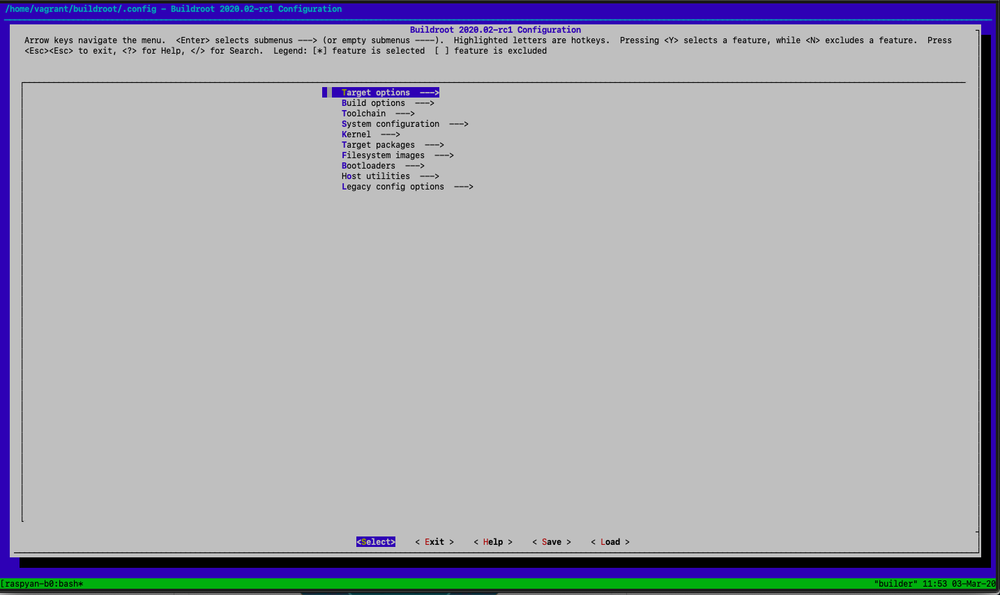
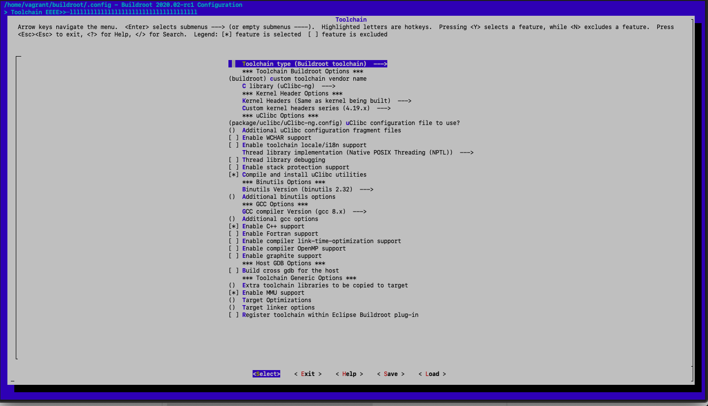
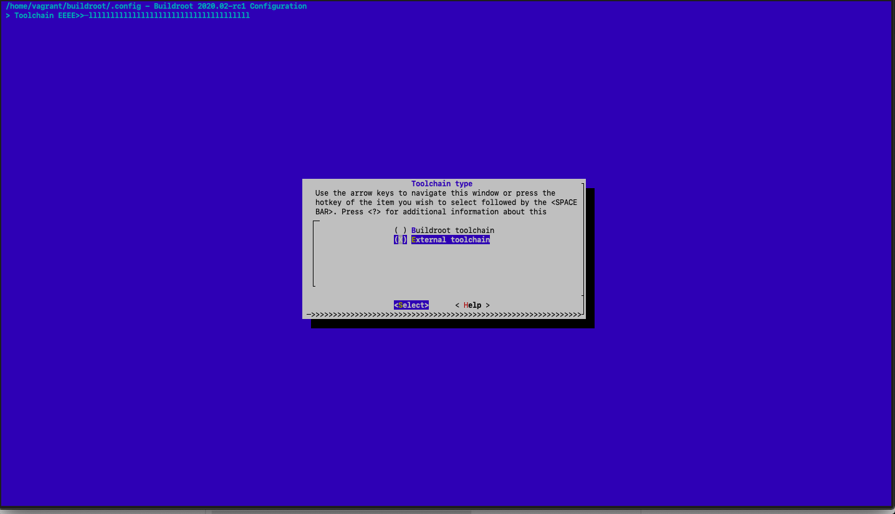

The buildroot user manual contains a [section](https://buildroot.org/downloads/manual/manual.html#_cross_compilation_toolchain)
explaining the various cross-compilation toolchain configuration options.

### System Configuration

You can tweak some system preferences, such as the host name, the password for the root user, overlay directories etc.
For Raspyan, the host name is `raspyan` and the default root password is `toor`.
Most importantly, in order to add the sources for the wormy game and its `init` script,
the path to the root filesystem overlay directory containing these files and their locations
must be specified here.

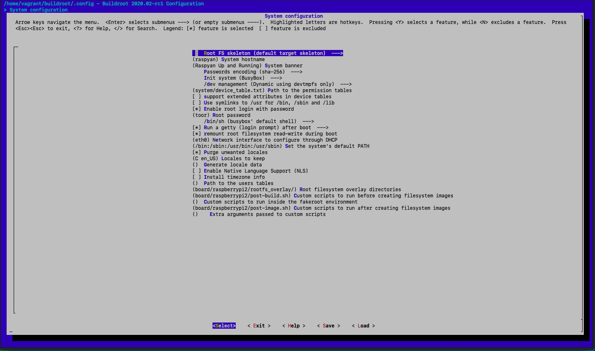
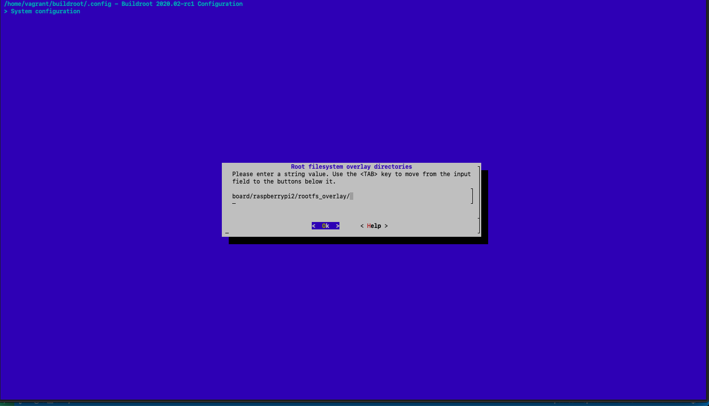

You can read more about overlay directories and other methods of customizing the root filesystem
from [this section](https://buildroot.org/downloads/manual/manual.html#rootfs-custom) of the buildroot documentation.

#### Overlay

The root filesystem overlay can be found [here](buildroot/board/raspberrypi/rootfs_overlay/),
with the following structure:

```text
buildroot/board/raspberrypi/rootfs_overlay/
  -- usr/bin/
    -- wormy
  -- etc/init.d/
    -- S80Wormy
```

These files will be installed on the target filesystem at the appropriate locations, for example `wormy`
will be installed at `/usr/bin/wormy`. The files in the `rootfs_overlay` must have the correct
permissions - both must be executable. Otherwise the init system won't be able to run the
[init daemon](buildroot/board/raspberrypi/rootfs_overlay/etc/init.d/S80Wormy), nor will the init daemon script
be able to run the [wormy game](buildroot/board/raspberrypi/rootfs_overlay/usr/bin/wormy).

### Target Packages

Buildroot gives a wide variety of packages to choose from, and they are split into several categories.
You can browse them by entering the `Target packages` menu from the main menu. By default, none of these
packages will be selected.

Since the Wormy game used in this project is written in Python, the system that will be built
must contain a Python interpreter, and luckily buildroot provides it. To enable it, from the `Target packages`
menu enter `Interpreter languages and scripting` and enable `python3`.

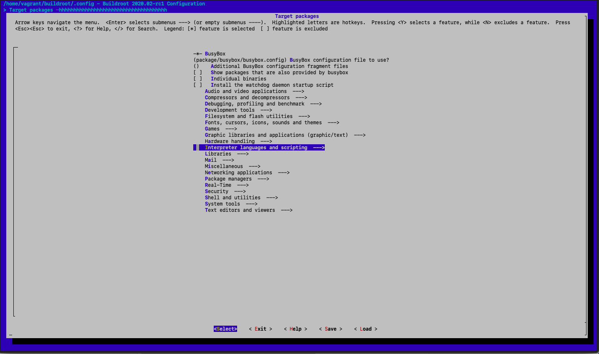
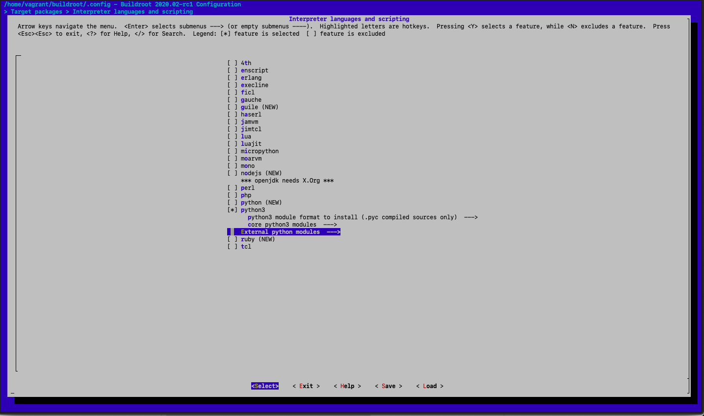

Once `python3` is enabled, a few other menus appear - of importance is the `External python modules` menu, since
from here the dependencies of the Wormy game can be satisfied, i.e. the `python-pygame` module.

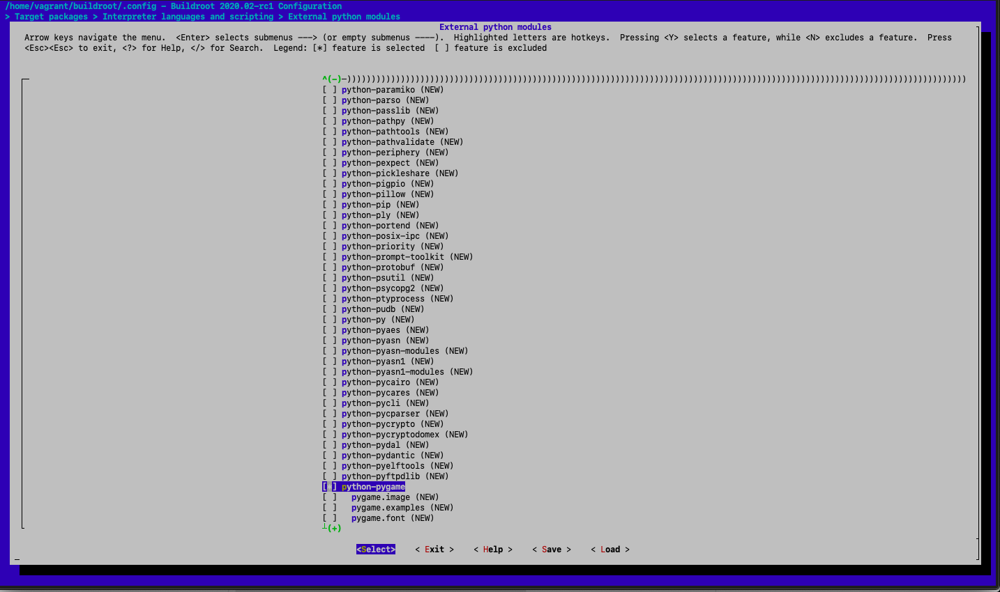

More information about buildroot packages, as well as how to include a custom, external package can
be found [in the manual](https://buildroot.org/downloads/manual/manual.html#adding-packages).

Another thing that Raspyan needs is a graphical window system, such as [X.org](https://www.x.org/wiki/),
in order to be able to spawn a window showing our game. To enable X.org and configure it,
you need to enable the X.org package from the `Graphic libraries and applications` menu, along with
SDL, a `pygame` dependency (which will probably be already enabled).

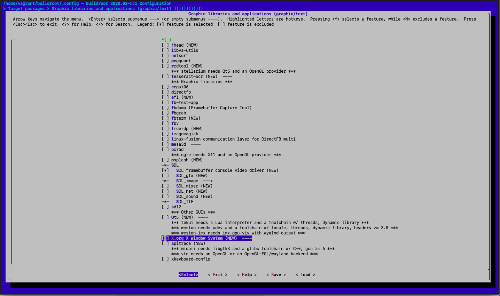

Once the X.org package is enabled, you need to enter the `X.org X Window System` submenu, and select
the following X11R7 applications:

- `xconsole`
- `xinit`
- `xkill`

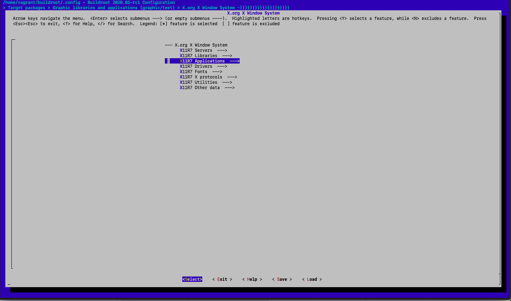

An X server will be started after booting Raspyan, and it will be possible to use a display to
draw graphics, such as a game or anything else.

### Kernel

Buildroot comes with prepared configuration files for the Linux kernel, which typically can be found at the root
of each board's directory. However, when building for Raspberry Pi, the kernel is grabbed from a custom location
and the default configuration is contained in that repository. The sources for this kernel can be found
on GitHub: <https://github.com/raspberrypi/linux>.

Buildroot offers some very basic kernel configuration options which are not used nor covered in this project.
If you wish to tweak the kernel, you can run `make linux-menuconfig` from within the buildroot directory
on the vagrant guest machine.

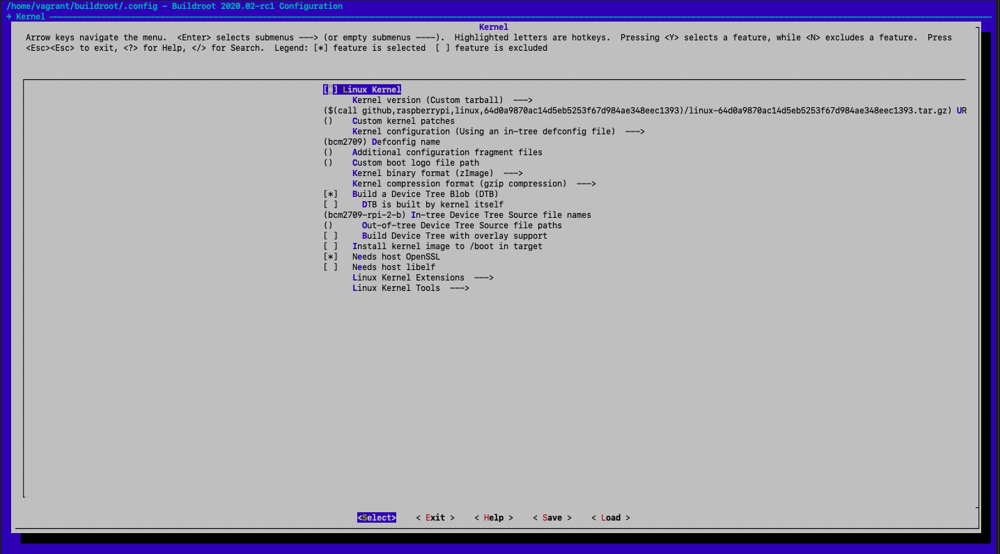

## Usage

After installing the [requirements](#Requirements) and making sure there is enough space on
the host machine, get the [Vagrantfile](Vagrantfile), along with [buildroot](buildroot/) from this repository.
The easiest way is to simply clone the repository:

```bash
git clone https://github.com/1uka/raspyan.git
cd raspyan
```

From inside the project directory, run `vagrant up`. This will initiate the creation of a Linux
virtual machine, that will be provisioned by vagrant using the [provision scripts](provision/).
After installing the dependencies inside the virtual machine, the build will initiate.
The build will take a long time (around 3 hours), so make yourself a coffee, go outside, take a nap.

After the build finishes, the build output is compressed in a tarball that can be found
at the project root directory (in the same directory as the `Vagrantfile`).

For more information about the contents of the build output, how to use the generated kernel,
filesystem and SDcard image check out the ["readme"](buildroot/board/raspberrypi/readme.txt)
for the Raspberry Pi board under buildroot.

### QEMU

Requirements:

- [QEMU](https://www.qemu.org) emulator version 4.2.0

For testing purposes, and just to check out that the newly built kernel simply boots and works
as intended, the system can be emulated using `qemu-system-arm`'s `versatilepb` machine.

You can build a Linux kernel configured with required options for running on
virtualized harware by setting the buildroot configuration file to
[`qemu_arm_versatile_raspyan_defconfig`](buildroot/configs/qemu_arm_versatile_raspyan_defconfig):

```bash
export BR2_DEFCONFIG=qemu_arm_versatile_raspyan_defconfig
vagrant up
```

Or, if the Vagrant machine is already up:

```bash
vagrant ssh
cd $HOME/buildroot
make qemu_arm_versatile_raspyan_defconfig
make
```

To run QEMU, use the provided [qemu.sh](qemu.sh) shell script. Make sure that the build output
is untarred in the project root directory, since the script expects to find it there.

## Next Steps

Booting into a single game is not really something very useful, yet this project covers
the steps needed to take in order to build a fully customized Linux system for embedded
devices and run any Python script or application with the help of an `init` system.
On top of that, the build is automated, the configuration file is manually modified
only the first time, and the build can be recreated.

Possible improvements:

- [ ] Add more games, for example [all Python games for Raspberry Pi](https://www.raspberrypi.org/documentation/usage/python-games/)
- [ ] Boot to a graphical game selection menu, with additional submenus such as
  - [ ] system configuration;
  - [ ] app (game) store with games that can be downloaded;
  - [ ] system control functions (shutdown, reboot, etc)
- [ ] Reconfigure the Linux kernel to disable unused drivers and modules
- [ ] Implement a build pipeline that would build, deploy and test automated builds in the cloud
